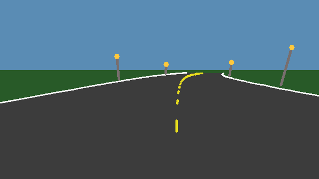
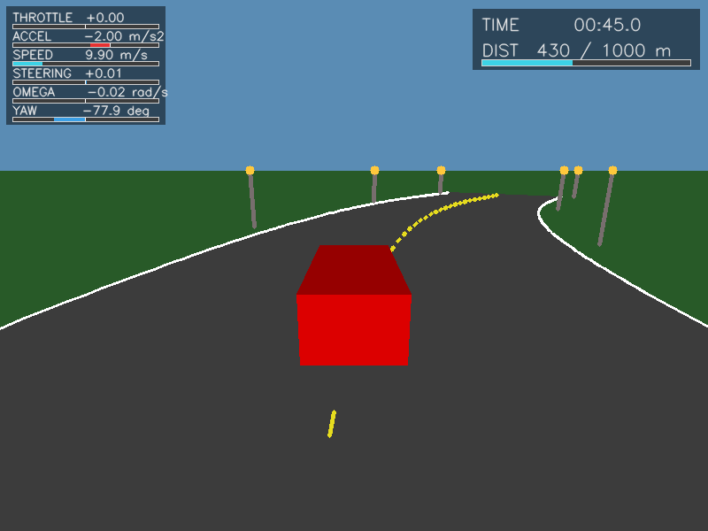
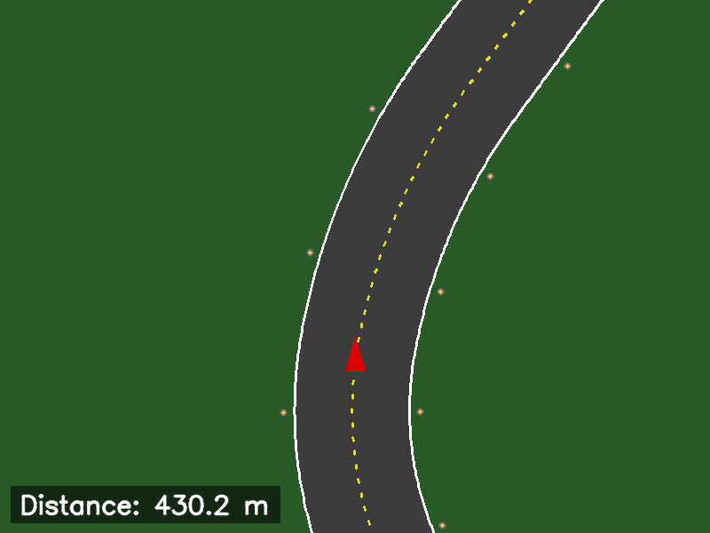

# car_sim

A lightweight 2D kinematic driving simulator, built as the testbed for learning
classical (PID) and RL-based lane-following control. No game engine, no 3D
assets — just numpy/OpenCV rendering a procedurally generated road and two
simulated cameras, all wired up over ROS2 topics so classical and RL
controllers can be dropped in as separate packages later.

## Pipeline

```
                    ┌──────────────────────────────────────────────┐
                    │                    sim_node                    │
                    │                                                  │
/car/steering ─────▶│  road.py ──▶ car_model.py ──▶ render.py        │──▶ /car/camera/image_raw      (front camera, for lane detection)
/car/throttle ─────▶│  (RoadGenerator: (CarState:      (renders all    │──▶ /car/player_view/image_raw (3rd-person, drives manual play)
  both Float32,      │   procedural       yaw + speed,   3 views using  │──▶ /car/chase/image_raw       (map view; visualization only)
  continuous)        │   curvature +      both integrated  road+car+    │──▶ /car/game_over              (off-road / victory flag)
                    │   poles+dashes)    from commands)   camera state) │
                    └──────────────────────────────────────────────┘
                                      ▲              ▲
                                      │ steering      │ throttle
                    ┌─────────────────┴──────────────┴─────┐
                    │          manual_control_node            │   (manual play only)
                    │  pygame window: shows /car/player_view,  │
                    │  arrow keys → /car/steering + /car/throttle │
                    └────────────────────────────────────────┘
```

`sim_node` is the single source of truth: it owns the car's state, the
procedurally generated road, and two camera models, and renders every frame
from that shared state — unconditionally, every tick, regardless of whether
a human or an automatic controller is driving. `manual_control_node` is a
thin I/O adapter — it only runs during manual play, displaying the player
view and turning arrow-key state into `/car/steering`/`/car/throttle`. An
automatic controller (PID, RL, ...) is just another node that subscribes to
`/car/camera/image_raw` and publishes to those same two topics — no changes
to `sim_node` needed.

## Example output

The three published views, mid-drive on a curve (rendered with the default
params in `config/sim_params.yaml`):

| `/car/camera/image_raw` (front camera, for lane detection) | `/car/player_view/image_raw` (drives manual play, HUD overlay) | `/car/chase/image_raw` (map view, visualization only) |
|---|---|---|
|  |  |  |

## Modules — what each script does

| File | Contents |
|---|---|
| `road.py` | `RoadGenerator` — the road's geometry, roadside poles, and the lane-dash pattern. Pure generation, no rendering, no ROS. |
| `car_model.py` | `CarState` — the car's physics: yaw and speed as integrated state, driven by two continuous commands. No rendering, no ROS. |
| `camera_model.py` | `PinholeCamera` — camera intrinsics/extrinsics/projection math (real pinhole projection, not an approximation). Reused for both the front camera and the player-view camera, just with different mount pose/FOV/pitch. |
| `render.py` | All drawing, for all three views. Pure visualization: takes road + car + camera *state* and produces pixel arrays; never touches ROS. Only depends on a road object via the `RoadLike` protocol it defines at the top of the file — a different/simpler/more complex `road.py` works here unmodified as long as it implements that contract (see below). |
| `sim_node.py` | ROS2 node: owns one `RoadGenerator`, one `CarState`, two `PinholeCamera`s (front + player-view); runs the tick loop, applies game rules, publishes all topics. |
| `manual_control_node.py` | ROS2 node: pygame window + keyboard capture. Converts held arrow keys into continuous steering/throttle commands via ramping. Fully separate from `sim_node`; only runs during manual play. |

### `road.py` — `RoadGenerator`

Builds an endless road centerline ahead of the car via a **rate-limited
random walk on curvature**: every `segment_length` meters a new target
curvature is sampled from `[-max_curvature, max_curvature]`, and the current
curvature is steered toward that target at no more than `curvature_rate` per
meter — this is what keeps turns smooth instead of kinking. Integrating
curvature gives heading, integrating heading gives position; each generated
point is stored as a waypoint `(x, y, heading, curvature, s)`, where `s` is
arc-length from the road's start (`s=0`).

- A rolling window of waypoints is kept: `lookahead` meters ahead of the car
  and `keep_behind` meters behind it are generated/retained; anything older
  gets pruned every tick (`update(car_s)`). The road doesn't know or care
  where the car actually is in `(x, y)` — it only takes a distance-traveled
  scalar, so it keeps generating/pruning correctly even if the car has
  drifted off-track.
- `straight_start` meters at the very beginning are forced straight (curvature
  target stays 0 until `s` passes this), giving a warm-up stretch before any
  turns appear.
- **Poles** (roadside landmarks): placed on both sides every `pole_spacing`
  meters of arc-length, `pole_side_offset` meters beyond the road edge, as
  `(x, y, s)` in `self.poles`. Because they're anchored to arc-length
  (generated during the same `_step()` that advances `s`) rather than to the
  car's position, they're **static landmarks the car drives past** — this is
  what makes forward motion read as the car moving through a static world,
  instead of the road appearing to scroll/rotate under a stationary car.
  Queried via `poles_in_range(s_start, s_end)`.
- **Lane dashes**: `lane_dash_on(s)` is a pure function of arc-length — `True`
  for `lane_dash_length` meters, then `False` for `lane_dash_gap` meters,
  repeating from `s=0`. Any caller (in `render.py`) must decide whether to
  draw a segment using each waypoint's own `s`, never its position/index in
  whatever sublist happens to be currently visible — an earlier bug drew
  dashes by list index, and since the visible-window's starting index shifts
  as old waypoints get pruned, the dashes visibly drifted instead of holding
  still. Anchoring to `s` fixed it, the same principle as the poles.
- `finish_distance`: if set, `extend_to()` never generates past it — the road
  simply ends there (used for the victory finish line, see Game rules below).
- `reset(seed)`: fully reinitializes (new/same seed), used by `/car/reset`.

### `car_model.py` — `CarState`

A **kinematic bicycle-model** car: a rigid body with a `wheelbase`, front
wheels that steer, rear wheels that only roll (no sideways slip) — the
standard model used throughout self-driving/robotics literature (it's what's
behind controllers like Stanley/Pure Pursuit). **Both yaw and speed are real
integrated state**, each driven by its own continuous command every tick:

**Steering → yaw** (`steering` in `[-1, 1]`, clamped):
```
delta      = -steering * max_steer_angle       # front-wheel angle (radians)
omega_raw  = (speed / wheelbase) * tan(delta)   # turn rate - NOT commanded directly
lat_accel  = speed * omega_raw
if |lat_accel| > max_lat_accel:                 # tire grip limit (~1.5 g default)
    omega = max_lat_accel / speed  (same sign)  # capped: tires would slide first
else:
    omega = omega_raw
yaw += omega * dt
```
Two things this fixes over a naive "yaw rate = steering command" model:
1. **At `speed == 0`, `omega == 0` regardless of steering.** Turning the
   wheel while parked doesn't spin the car — you have to be rolling, same as
   a real car. (An earlier, simpler version of this sim commanded omega
   directly, independent of speed, which let the car visibly rotate in
   place while stationary — physically wrong, and this is the fix.)
2. **`omega` is capped by `max_lat_accel`.** The raw formula above has no
   speed limit built in — at high speed a full-lock turn would imply
   unrealistic lateral g-forces (tens of g at highway speed) since nothing
   stops `omega` from scaling with speed. Real tires only generate so much
   sideways force before sliding, which is what actually limits a real car's
   turn rate at speed; `max_lat_accel` models that limit directly. This also
   means turning noticeably "weakens" at high speed by design — a wide,
   gentle arc at high speed and a tight turn at low speed are both the grip
   cap doing its job, not a bug.

**Throttle → speed** (`throttle` in `[-1, 1]`, clamped):
```
if throttle > 0:  accel = throttle * max_accel     # proportional acceleration
elif throttle < 0: accel = throttle * max_decel     # proportional braking
else:               accel = -friction_decel          # no input: passive coast-down

speed = clamp(speed + accel*dt, 0, max_speed)         # no reverse
```
`max_decel` is set higher than `max_accel` by default (braking outperforms
the engine, like a real car); `friction_decel` is separate and much gentler
(releasing both pedals coasts down slowly, it isn't the same as braking).
The car starts at `speed = 0` on spawn and after `/car/reset` — it has to
accelerate from a stop, it doesn't start already cruising.

**Position** integrates from yaw and speed as usual:
```
x += speed * cos(yaw) * dt
y += speed * sin(yaw) * dt
distance_traveled += speed * dt
```

`omega` and `accel` are stored as read-only state after each `step()` call
(not just local variables) specifically so `sim_node` can read the car's
*actual* current turn rate/acceleration for the telemetry HUD, without
recomputing them.

### `camera_model.py` — `PinholeCamera`

A real pinhole projection — not a pseudo-3D approximation — parameterized by
resolution + horizontal FOV (which determines focal length) and a
pitch/mount configuration:

- `extrinsics(car_x, car_y, car_yaw)`: camera rigidly mounted on the car, at
  the car's own `(x, y)` and this camera's `mount_height`, yawed with the
  car. Used for the front camera.
- `extrinsics_at(cam_x, cam_y, cam_z, yaw)`: camera at an *arbitrary* world
  pose. Used for the player view, whose camera sits `player_back_offset`
  meters behind and `player_cam_height` meters above the car.
- `horizon_row`: the pixel row where a level ground plane vanishes to
  infinity, derived purely from the tilt (`cy - fy*tan(pitch)`) — used to
  split sky/grass background and to reject numerically unstable points near
  the vanishing point when rendering.

### `render.py` — all drawing

Renders three views, all from the same road/car/camera state:

- **`render_camera()`** — front camera, real perspective projection. The car
  itself is invisible here (it *is* the camera).
- **`render_player_view()`** — pulled-back third-person perspective (a real
  camera positioned behind/above the car, not a 2D affine trick), with a
  simple 3D box drawn for the car (rear face + roof, near-plane clipped) and
  the telemetry HUD overlay.
- **`render_chase()`** — a 2D orthographic map view: rotate the world so the
  car points up-screen, scale by pixels-per-meter, draw. No camera model at
  all, unlike the other two.

Shared machinery: `_render_road_scene()` draws the road surface, edges, lane
dashes, poles, and finish checker for both perspective views, via **proper
near-plane polygon clipping** (Sutherland-Hodgman) rather than simple
per-corner validity checks — an earlier version discarded an entire
road-surface quad whenever *any* corner failed a depth test, which produced a
visible gap ("green patch") whenever the camera yawed enough that one corner
of a quad legitimately fell behind it while the rest of the quad was still
plainly visible. The clip keeps the visible portion instead of discarding the
whole primitive. For performance, points are first validity-tested with one
batched vectorized pass; the expensive per-primitive clip only runs on the
handful of quads/segments that actually straddle the near-plane or horizon
boundary each frame.

The visible-waypoint window for both perspective views is centered on the
**camera's own recovered position** (`cam_pos = -R.T @ t`), not the car's —
`render_player_view`'s camera sits meters behind the car, so windowing
around the car alone left the ground right under the camera undrawn (a
second, distinct cause of the same "green patch" symptom, fixed separately).

**The `RoadLike` protocol**: `render.py` never imports `road.py` — every
function that takes a `road` argument only calls methods on it (`width`,
`waypoints`, `nearest_waypoint()`, `waypoint_at_s()`, `reaches()`,
`poles_in_range()`, `lane_dash_on()`). This contract is formalized as a
`typing.Protocol` (`RoadLike`, `@runtime_checkable`) at the top of the file,
documented there. Any object implementing it — a simpler road, a more
complex one, a fixed hand-authored track — is renderable by this module
completely unmodified.

**Telemetry HUD** (`draw_telemetry_hud`): two panels on the player view,
sized as fractions of the canvas so they scale with any resolution (same
convention as every other overlay in this file):
- top-left (30% smaller than the top-right panel) — THROTTLE, ACCEL, SPEED,
  STEERING, OMEGA, YAW, each a labeled bar gauge. Signed quantities (accel,
  steering, omega, yaw) fill from a center zero-line rather than from the
  left, so direction is visible at a glance; throttle/accel are colored
  green when positive and red when negative.
- top-right — elapsed time (mm:ss) and a distance-traveled-vs-target
  progress bar.

**Game-state overlays** (`draw_end_state_overlay`): a translucent banner
("GAME OVER" / "VICTORY!") drawn over the middle of a frame; coexists
cleanly with the HUD since the HUD lives in the corners.

### `sim_node.py`

Owns one `RoadGenerator`, one `CarState`, and two `PinholeCamera`s (front +
player-view). Each tick (`tick_rate` Hz):

1. `car.step(steering, throttle, dt)` — advance physics from the two latest
   received commands (frozen while the episode is over — see below).
2. `road.update(car.distance_traveled)` — extend/prune the road window.
3. Check off-road (`|lateral_offset| > road_width/2`) → game over; check
   `distance_traveled >= finish_distance_m` → victory.
4. Render + publish all three views, plus `/car/game_over`.

**Game rules / freeze behavior**: once off-road or victorious, `sim_node`
stops all physics, road generation, and per-tick rendering — it renders the
end-state frame (with the GAME OVER/VICTORY banner) exactly once and just
republishes that same cached image every tick, so late subscribers still see
current state without any wasted recomputation. `/car/reset` clears this and
respawns the car at rest with a regenerated road (same seed by default).

Difficulty (`DIFFICULTY` in `sim_node.py`, finish line = `DIFFICULTY * 1000`
meters) is a code-level constant for now, not a launch parameter.

### `manual_control_node.py`

Displays `/car/player_view/image_raw` in a pygame window and publishes
`/car/steering` + `/car/throttle`. Since a key is digital (down or up),
proportional control ("how much", not just direction) comes from **ramping**:
holding a key ramps that axis's value toward ±1 at `steer_ramp_rate`/
`throttle_ramp_rate` units/s; releasing it self-centers back toward 0 at
`steer_center_rate`/`throttle_center_rate` units/s (shared logic, one
function, two independent axis instances). A quick tap gives a small input;
holding builds toward full deflection — the analog feel of a real controller
out of four digital keys. A future PID/RL controller skips this ramping
entirely and just publishes its desired `[-1, 1]` value directly each tick.

## Nodes

| Node | Runs when | Does |
|---|---|---|
| `sim_node` | always | physics, road generation, rendering, game rules |
| `manual_control_node` | manual play only | pygame player-view window + arrow keys → `/car/steering` + `/car/throttle` |

## Topics & services

| Name | Type | Direction (sim_node) | Notes |
|---|---|---|---|
| `/car/steering` | `std_msgs/Float32` | sub | `[-1, 1]`: -1 = full left, +1 = full right, proportional in between |
| `/car/throttle` | `std_msgs/Float32` | sub | `[-1, 1]`: >0 accelerates, <0 brakes, 0 coasts down under friction |
| `/car/camera/image_raw` | `sensor_msgs/Image` | pub | front-facing pinhole camera feed, BGR8 |
| `/car/player_view/image_raw` | `sensor_msgs/Image` | pub | pulled-back 3rd-person perspective camera + telemetry HUD — what the manual-play window displays and drives from |
| `/car/chase/image_raw` | `sensor_msgs/Image` | pub | car-relative map view; visualization only, not used to drive |
| `/car/game_over` | `std_msgs/Bool` | pub | true once off-road or victory; episode is frozen (see above) |
| `/car/reset` | `std_srvs/Trigger` | service | respawns the car (at rest) and regenerates the road (same seed) |

Both control axes are continuous and independent — any controller (manual,
PID, RL) drives the car identically, by publishing to both. All three image
topics publish every tick unconditionally, regardless of what's driving.

## Parameters (`config/sim_params.yaml`)

| Group | Params |
|---|---|
| Car physics | `wheelbase` (m), `max_steer_angle_deg`, `max_lat_accel` (m/s², tire grip limit), `max_accel`, `max_decel`, `friction_decel` (m/s²), `max_speed` (m/s) |
| Road | `road_seed`, `road_width`, `waypoint_spacing`, `segment_length`, `max_curvature`, `curvature_rate`, `lookahead`, `keep_behind`, `straight_start_m` |
| Poles / dashes | `pole_spacing`, `pole_side_offset`, `pole_height`, `lane_dash_length`, `lane_dash_gap` |
| Sim | `tick_rate` (Hz) |
| Front camera | `camera_width`, `camera_height`, `camera_hfov_deg`, `camera_mount_height`, `camera_pitch_deg`, `camera_render_distance` |
| Player view | `player_width_px`, `player_height_px`, `player_hfov_deg`, `player_pitch_deg`, `player_cam_height`, `player_back_offset` (meters behind the car), `player_render_distance` |
| Map/chase view | `chase_width_px`, `chase_height_px`, `chase_scale` (px/m), `chase_car_x_frac`, `chase_car_y_frac` (car's position as a *fraction* of the canvas, so the whole layout scales seamlessly if you resize the canvas) |

Current defaults for the car-physics group, chosen to sit in realistic
road-car ranges (with real-world reference values alongside):

| Param | Default | ≈ g | Realistic road-car range |
|---|---|---|---|
| `wheelbase` | 2.7 m | — | 2.5–2.8 m (typical sedan) |
| `max_steer_angle_deg` | 35° | — | ~30–35° typical front-wheel lock |
| `max_lat_accel` | 14.71 m/s² | 1.5 g | 0.8–1.0 g (road tires) – 1.5 g+ (sticky/track tires); this is on the grippy side, deliberately, for a more responsive high-speed feel |
| `max_accel` | 5.0 m/s² | 0.5 g | 2.5–4 m/s² (average car) – up to ~9-10 m/s² (quick EV/sports car); 5.0 sits mid-pack, plausible for a sporty car |
| `max_decel` | 10.0 m/s² | 1.0 g | 8–10 m/s² (road car max braking) |
| `friction_decel` | 2.0 m/s² | 0.2 g | 0.5–1.5 m/s² (pure rolling resistance/drag); 2.0 is slightly brisk but plausible with some engine braking included |
| `max_speed` | 50.0 m/s | — | 180 km/h — a fast highway/Autobahn-ish top speed |

`max_lat_accel` and `max_speed` still interact (see the car_model.py section
above): even with a realistic grip limit, high speed inherently means wide,
gentle turns rather than tight ones — that's the physically-correct
trade-off the grip cap enforces, not a bug to fix by raising the cap
further.

`manual_control_node` has its own params (set via `declare_parameter`
defaults, not in this yaml): `publish_rate`, `window_width`, `window_height`,
`steer_ramp_rate`, `steer_center_rate`, `throttle_ramp_rate`,
`throttle_center_rate`.

`road_seed` is also a launch argument (`road_seed:=<int>`) for reproducible
episodes, e.g. when comparing PID vs. RL runs or varying it across RL
training episodes.

## Running it

Manual play (sim + pygame control window):
```
ros2 launch car_sim manual_play.launch.py [road_seed:=123]
```

Sim only (for an automatic controller package to launch alongside):
```
ros2 launch car_sim sim_only.launch.py [road_seed:=123]
```

## Repo layout

This package is one repo in a multi-repo ROS2 workspace
(`lane_drive_ws/src/`) — `car_sim` here handles the game/simulation only.
Classical and RL controllers live in their own separate repos
(`car_pid_control`, `car_rl_control`), each subscribing to
`/car/camera/image_raw` and publishing to `/car/steering`/`/car/throttle`,
so they're interchangeable without touching this package.
